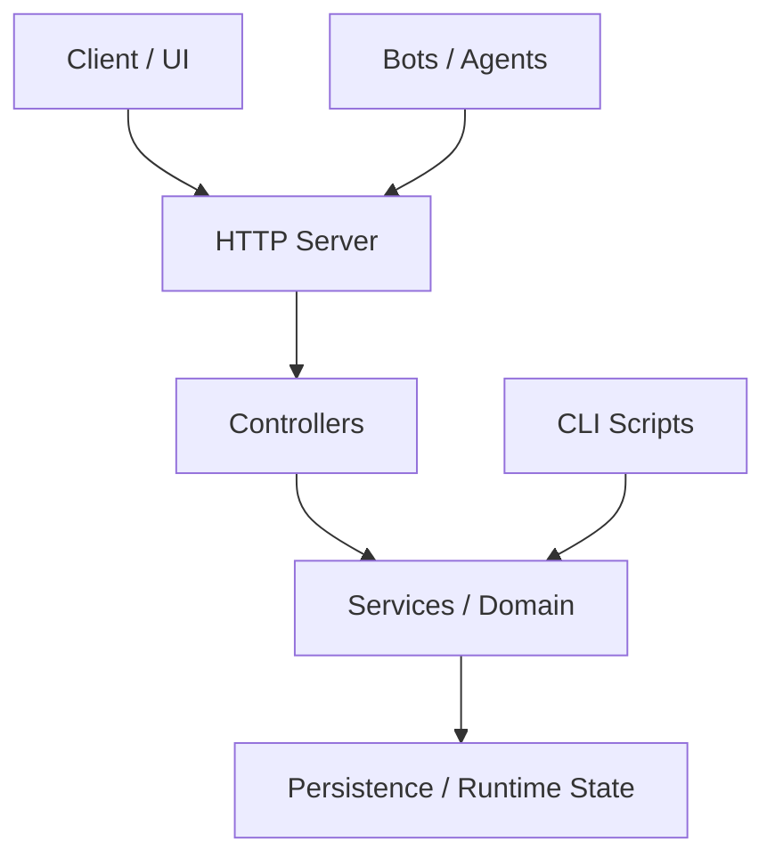

# tiger-lab-private Blueprint

Version: 0.1.0
Generated: 2026-06-13T07:24:25.348Z
Product Type: SaaS

## Summary

Private internal lab for advanced full-stack, DevOps, and AI projects

## Architecture

## Tech Stack

- Runtime: Node.js 20+
- Language: TypeScript
- Testing: Vitest
- Payments: Stripe + PayPal
- State: JSON files in ops/runtime/

## Key Directories

- src: 142 source files
- server: 77 source files
- shared: 1 source files
- bots: 7 source files

## Key Dependencies

- pg
- sql.js
- tsx

## Development Dependencies

- @types/node
- @types/pg
- @vitest/coverage-v8
- sharp
- typescript
- vitest

## Improvements

1. Add integration tests (high priority)
2. Add request validation schemas (medium)
3. Add CI caching for faster builds (low)
