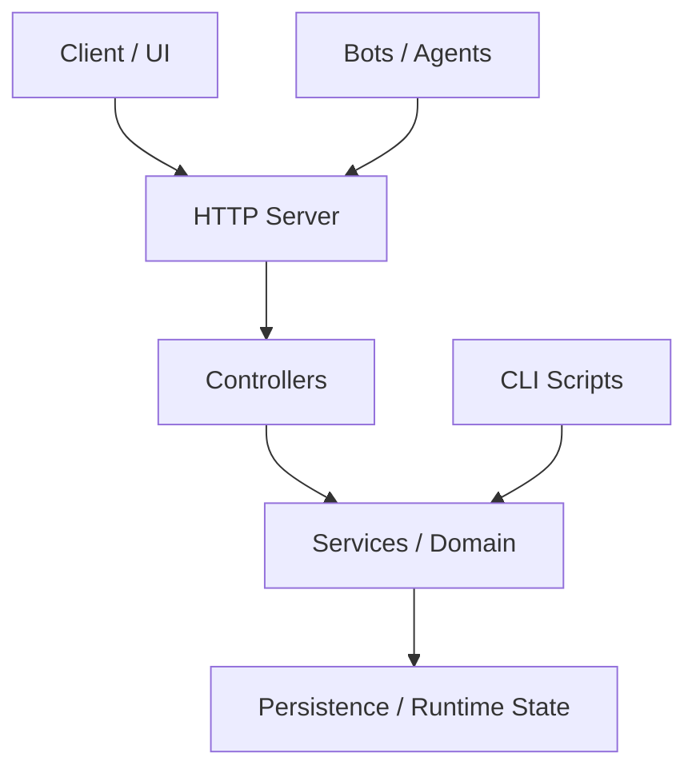

# tiger-lab-private Blueprint

Version: 0.1.0
Generated: 2026-06-13T08:40:15.473Z
Product Type: SaaS

## Summary

Private internal lab for advanced full-stack, DevOps, and AI projects

## Architecture

## Tech Stack

- Runtime: Node.js 20+
- Language: TypeScript
- Testing: Vitest
- Payments: Stripe + PayPal
- State: JSON files in ops/runtime/

## Key Directories

- src: 142 source files
- server: 77 source files
- shared: 1 source files
- bots: 7 source files

## Key Dependencies

- pg
- sql.js
- tsx

## Development Dependencies

- @types/node
- @types/pg
- @vitest/coverage-v8
- sharp
- typescript
- vitest

## Product Catalog (5 products)

- FacturAutentico Cloud: 56/100 [P1] (paused) — PAC contratado + integración + documentación
- Docflow API: 84/100 [P3] (active) — Integraciones + documentación + CI/CD
- Sentrylog Lite: 38/100 [P1] (planned) — Build completo + monetización + benchmarks
- Script Premium Kit: 84/100 [P3] (active) — Integraciones + documentación + automatización
- FacturAutentica: 56/100 [P1] (paused) — PAC contratado + motor CFDI + documentación

## R&D INVEST Pipeline (7 ideas)

- DevTools GDPR Middleware: INVEST 88/100 [devtools] EU:high — 99/mo
- EU AI Act Readiness Platform: INVEST 87/100 [ailegal] EU:critical — 99/mo
- GDPR Auto-Compliance Scanner: INVEST 84/100 [devtools] EU:high — 49/mo
- SaaS Localization Engine EU: INVEST 84/100 [devtools] EU:high — 49/mo
- Carbon Accounting API for EU SMEs: INVEST 82/100 [climatetech] EU:mandatory — 49/mo
- PSD3 Open Banking Connector: INVEST 80/100 [fintech] EU:high — 49/mo
- Cross-Border VAT Automator: INVEST 80/100 [fintech] EU:high — 49/mo

## Improvements

1. Add integration tests (high priority)
2. Add request validation schemas (medium)
3. Add CI caching for faster builds (low)
